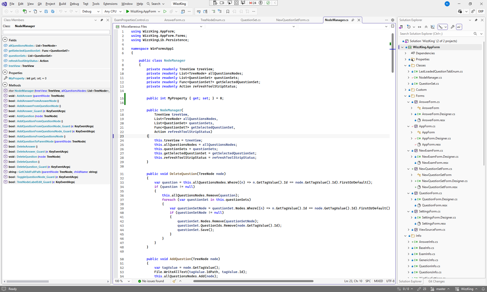
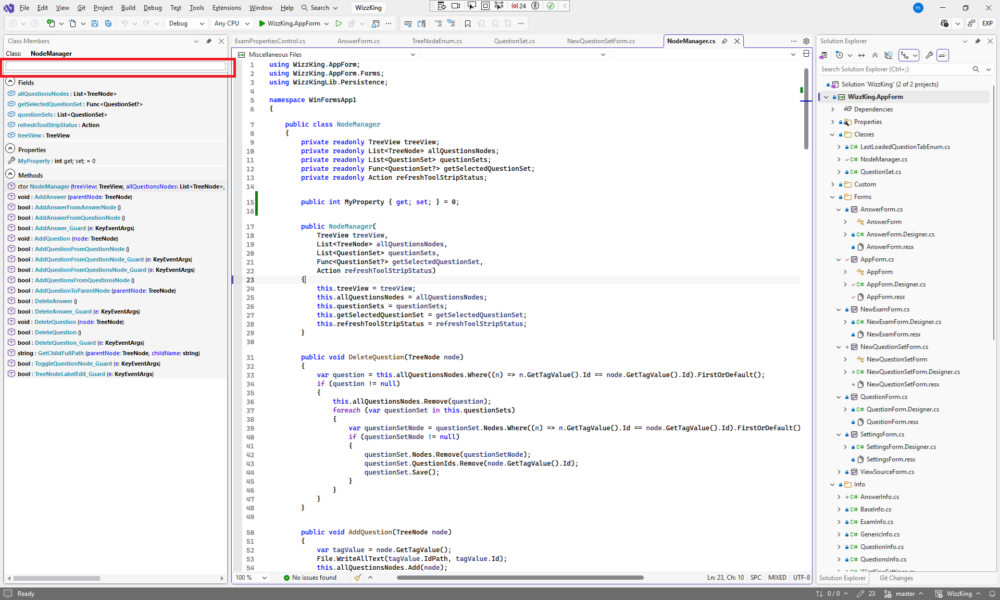

# Overview
This extension installs "Class Members" tool window for C# projects.  

The window displays a class, interface, 
struct, record or struct record members of the currently open C# class/interface/struct/record/struct record.

The extension is supported only for <b>VS.NET 2026</b>.

# Installation
The extension automatically opens "Class Members" tool window upon installing.  

You can hide it by clicking "x". When you would like to see it again, open <b>"Extensions/Class Members/Show Class Members"</b> menu item from the IDE.

# Use
When "Class Members" tool window is open, it automatically synchronizes to the currently open C# class.

To filter class members for a phrase, enter the phrase in the text box in the Class Members tool window.

# Support

This extension is only available for VS.NET 2026 (all editions). Previous versions of VS.NET are not supported.  

The extension has rudimentary support for VS.NET 2026 themes.

# Releases

<h2>1.0.0</h2>

Initial release of the extension
[1.0.0](https://drive.google.com/uc?export=download&id=1mkqwlqC3isVXNulByAL5zyCh1kM0DmBs)
